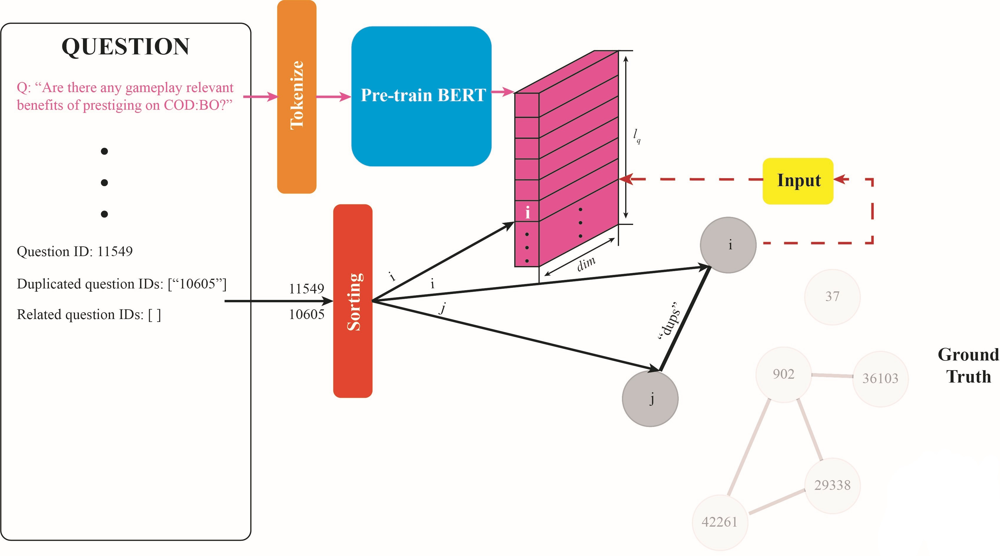
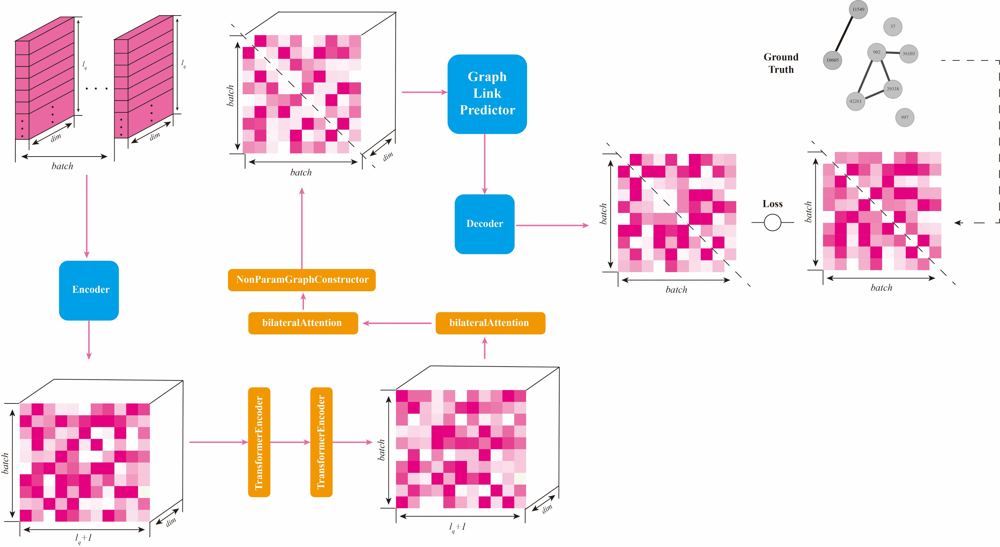

# GNN based Duplicated/Related Question Retrieval in Community Question Answering

## 背景

当代网络中数据量不断增加，而有效的非重复数据却并没有实质性增长，这点在问答社区中十分泛滥。因此，重复问题的检索、去除对于构建信息密集型社区非常重要。另一方面，用户搜索一个新问题时，往往可以为其检索到相关问题，从而避免重复提问，从根源上解决重复问题泛滥的问题。

## 建模

对于给定问题Q_new，我们希望能从已有问题集合Q={Q1,…,Qn}中检索到一个子集Q’，使得子集Q’中的每个问题都与Q_new相关（或重复）。这种建模能够关注到数据库中问题之间的相互联系，避免了在实际应用中遍历数据库，每一条都“二分类”这种计算量大，耗时长的做法。

## 数据集

使用以`Stack Exchange`社区下的问答数据集构建的`CQADupStack`完成社区问题中的重复/相似问题检索任务。

## 数据预处理

通过图搜索保留了全部的问题-问题(QQ)连接，即根据人工标注的duplicate和relevant的连接。为了使用四折交叉的验证方式，对数据集进行了随机采样，划分出了每一折的train和test数据，并保证了每train与test不存在QQ连接、每一折中的类别比例相近。Question的主要参数title经过BERT的预训练模型进行了word-level embedding。

## 模型简略框架

Transformer学习后通过双边的attention更新隐层顺序结构，然后通过对称性的矩阵方法构造初始化的无向图。基于神经链接预测器的思想((Nickel et al., 2016)构建GLP网络层，包含一阶逻辑算子(Leskovec et al.,2020)，然后通过由GAT等网络层构成的decoder输出为预测无向图。最后将预测无向图和实际的无向图做对比计算Loss。

